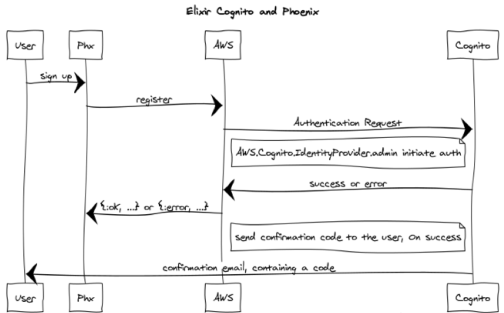

# CognitoPhx

Integrating [Cognito](https://aws.amazon.com/documentation/cognito/) and [Phoenix 1.3](http://phoenixframework.org/), using [AWS clients](https://github.com/jkakar/aws-elixir), for Elixir

The following functionality is covered;

* User registration
* Confirm registration (with the confirmation code received from AWS, by email)
* User login
* Accessing a secured page if logged in
* Resetting a forgotten password (not yet, sorry)
* Logout

Integration is a tad tricky, given the verbosity of the API. Below is a simplified sequence diagram illustrating the user registration



### Build, start

Pull the project from Gitlab

```sh
$ git clone git@gitlab.com:azohra/cognito-phx.git
$ cd cognito-phx
```
### Set up AWS Cognito with the correct configuration
First we will set up a new AWS Cognito user pool with the correct configuration.

1. Visit your AWS console and go to the AWS Cognito service. Click on "Manage your User Pools" and click "Create a User Pool".
2. Specify a name for your pool and click "Review Defaults".
3. Optional: edit the password policy to remove some of the requirements. If you are just testing, using simple passwords will make it easier.
4. Click the "edit client" link. Specify a name for your app and be sure to *disable* the client secret and *enable* the `ADMIN_NO_SRP_AUTH` option.
5. Click "Create pool". Take note of the *Pool Id* at the top of the page and click on the apps page. Here, take note of the *App client id*.

For this demo to run, you also must define some local system variables:

```sh
export AWS_ACCESS_KEY_ID="xxx"
export AWS_SECRET_ACCESS_KEY="xxxx"
export AWS_REGION="xxxxxx"
export AWS_AZOHRA_CLIENT_ID="xxx"
export AWS_AZOHRA_USER_POOL_ID="xxxx"
```

Now you can start the Phoenix app.

### To start your Phoenix server:

* Install dependencies with `mix deps.get`
* Install Node.js dependencies with `cd assets && npm install`
* Start Phoenix endpoint with `mix phx.server`

Now you can visit [`localhost:4000`](http://localhost:4000) from your browser.

HTH!   
Florin


#### Learn more

* Official Cognito [API reference](http://docs.aws.amazon.com/cognitoidentity/latest/APIReference/Welcome.html): 
